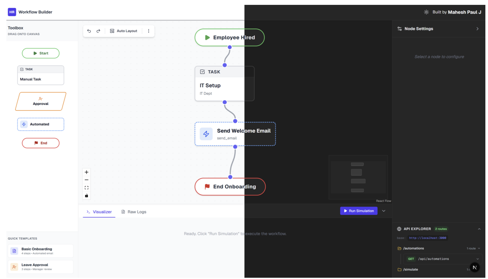
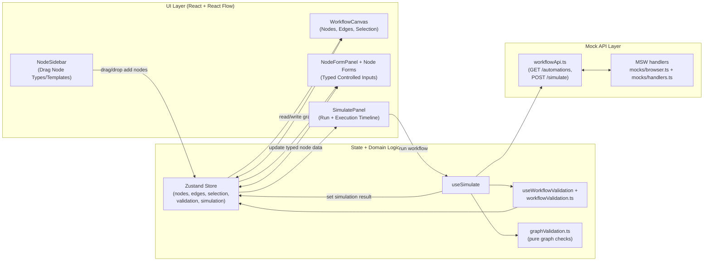

# HR Workflow Designer

A production-style case-study prototype for designing and simulating HR workflows (onboarding, leave approval, automation chains) with React Flow.

## Screenshot



## Stack

- React + TypeScript + Vite
- React Flow
- Zustand
- Zod
- MSW
- Tailwind CSS

## What Is Implemented

- 5 custom node types: Start, Task, Approval, Automated Step, End
- Left toolbox sidebar with drag-to-canvas cards
- Start-node card auto-disables once Start exists
- Quick templates: Basic Onboarding and Leave Approval
- Center canvas with:
  - connect/select/delete nodes and edges
  - built-in Controls + MiniMap + dotted background
  - toolbar actions: Undo, Redo, Auto Layout, Import JSON, Export JSON
- Right dark control panel with:
  - type-specific node configuration forms
  - edge label editing
  - simulation panel with execution timeline
- Dynamic Automated Step form:
  - loads actions from `GET /automations`
  - renders dynamic action parameters based on selected action
- Workflow validation:
  - exactly one Start
  - at least one End
  - no invalid connection structure
  - no cycles
  - node-level form validation
- Simulation engine (`POST /simulate`):
  - validates payload and graph
  - traverses workflow from Start
  - returns structured step logs
  - supports optional force-error mode for failure-path testing
- Keyboard shortcuts:
  - `Delete` / `Backspace`: remove selected
  - `Esc`: clear selection
  - `Cmd/Ctrl + Z`: undo
  - `Cmd/Ctrl + Shift + Z`: redo
- Workflow stats after successful simulation:
  - node counts by type
  - edge count
  - estimated duration
  - complexity label

## Why I Built It This Way

The two areas I intentionally polished the most were dynamic automation params and graph validation.

For the Automated Step form, the hard part is preventing stale param values when switching actions. I reset the param map every time `actionId` changes and regenerate keys from the selected API action. That keeps the form deterministic and avoids hidden state leaking between action types.

For validation, I kept the graph checks in pure functions and separated them from React state. This made it easier to test failure paths quickly (missing Start/End, disconnected nodes, cycles) and helped avoid UI-specific coupling in simulation logic.

I also chose Zustand because the canvas emits frequent updates; keeping store actions small and explicit felt cleaner than adding Redux boilerplate for this scope.

## Architecture Diagram



## Folder Structure

```text
src/
  api/
    workflowApi.ts
  components/
    canvas/
      CanvasToolbar.tsx
      NodeSidebar.tsx
      WorkflowCanvas.tsx
    forms/
      ApprovalNodeForm.tsx
      AutomatedNodeForm.tsx
      EdgeForm.tsx
      EndNodeForm.tsx
      FormPrimitives.tsx
      KeyValueEditor.tsx
      NodeFormPanel.tsx
      StartNodeForm.tsx
      TaskNodeForm.tsx
    nodes/
      ApprovalNode.tsx
      AutomatedNode.tsx
      EndNode.tsx
      NodeShell.tsx
      StartNode.tsx
      TaskNode.tsx
      index.ts
    sandbox/
      SimulatePanel.tsx
  constants/
    workflowTemplates.ts
  hooks/
    useAutomations.ts
    useKeyboardShortcuts.ts
    useNodeIssues.ts
    useSimulate.ts
    useWorkflowValidation.ts
  mocks/
    browser.ts
    handlers.ts
  store/
    workflowStore.ts
  types/
    nodeSchemas.ts
    workflow.ts
  utils/
    autoLayout.ts
    graphValidation.ts
    nodeFactory.ts
    workflowSerializer.ts
    workflowValidation.ts
```

## API Contract

### `GET /automations`

Returns mock action catalog:

```json
[
  { "id": "send_email", "label": "Send Email", "params": ["to", "subject", "body"] },
  { "id": "generate_doc", "label": "Generate Document", "params": ["template", "recipient"] },
  { "id": "send_slack", "label": "Send Slack Message", "params": ["channel", "message"] },
  { "id": "create_ticket", "label": "Create JIRA Ticket", "params": ["project", "summary"] }
]
```

### `POST /simulate`

Accepts:

```json
{
  "nodes": [...],
  "edges": [...],
  "forceError": false
}
```

Returns a structured run summary with `status`, `finalMessage`, `executedNodes`, `totalNodes`, and `steps` timeline entries.

## How to Run

```bash
git clone https://github.com/aryansharma1305/Tredence-FullStack-CaseStudy.git
cd Tredence-FullStack-CaseStudy
npm install
npm run dev
```

## Build and Lint

```bash
npm run build
npm run lint
```

## How to Add a New Node Type

1. Add data/type interface in `src/types/workflow.ts`
2. Add validation schema in `src/types/nodeSchemas.ts`
3. Add default node payload in `src/utils/nodeFactory.ts`
4. Add node renderer in `src/components/nodes/`
5. Register in `src/components/nodes/index.ts`
6. Add node form in `src/components/forms/`
7. Add routing case in `src/components/forms/NodeFormPanel.tsx`
8. Extend workflow validation and simulation messaging

## Architecture Decisions

High-level ADRs are documented in [DECISIONS.md](./DECISIONS.md).

## Known Limitations

- All data is in-memory; refresh resets graph state unless exported/imported manually.
- Cycle validation currently treats every cycle as invalid; conditional retry-loop semantics are not modeled yet.
- Canvas rendering is optimized for case-study scale; very large graphs (50+ nodes) would need deeper memoization/selective subscriptions.

## What I Would Do Differently With More Time

- Backend integration with FastAPI + PostgreSQL persistence and workflow version history.
- Role-based permissions for publish/edit actions and audit trail metadata.
- Playwright E2E scenarios for the simulation pipeline and richer unit coverage for store transitions.
- Collaborative editing via WebSockets or Liveblocks for multi-user workflow design.
